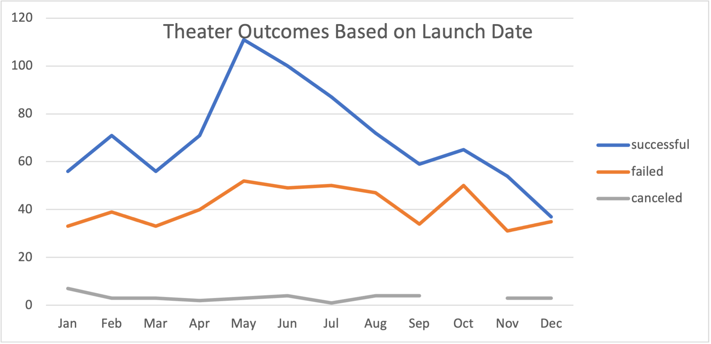
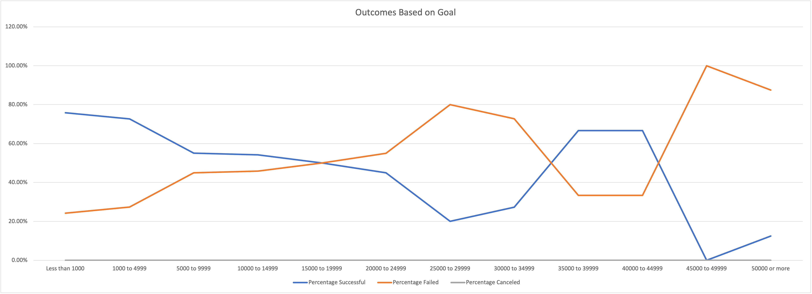

# Kickstarting with Excel
Kickstarter excel sheet available here: [Kickstarter Challenge](https://ucdavis.bootcampcontent.com/simranbains-OmwutO/kickstarter-analysis/-/blob/main/Kickstarter_Challenge_copy.xlsx.zip)

## Purpose of Project
This project aims to effectively analyze fundraising campaigns. We compared the funding goals and launch dates of successful, failed, and canceled campaigns in order to present our findings.  

## Analysis and Challenges
The dataset is quite large at 4000+ entries. We were presented with columns measuring the goal donation, pledged donation, outcome, country, launch date, backer count, and category/subcategory for each of the fundraising campaigns. Our main focus was to analyze and present the theater and play data. 

### Analysis of Outcomes Based on Launch Date
To analyze the outcomes based on launch date, we created a PivotTable that filtered by Parent Category and year. The rows measure months, and the columns show successful, failed, and canceled outcomes. The table was manipulated with the filters to analyze the successful, failed, and canceled outcomes for theater fundraising campaigns.    

### Analysis of Outcomes Based on Goals
To analyze the outcomes based on goals, we created a table that tracks the number of successful, failed, and canceled campaigns. These figures were collected with COUNTIFS to effectively sort and count the data. Additionally, "$" was added to lock the refernces in the COUNTIFS to prevent potential errors when applying the formula to the cells. 

Aditionally, the percentages of the successful, failed, and canceled outcomes were determined for each goal range. From the data seen below, we can see that highest concentration of successful campaigns is in the $0-$5,000 goal range. 

### Challenges and Difficulties Encountered
The main challenge during this process was creating the correct COUNTIFS formula to include all of the information we were looking for. Originally, the formula did not have information to recognize the maximum of each goal range. The numbers were skewed from a quality check and the formula required an adjustment. Once the adjustment was made, the sum of the successful column matched the quality check.

## Results

### Conclusions drawn from Theater Outcomes Based on Launch Date
The line chart below details theater outcomes based on which month they occured in. We learn that May has the highest occurrence of successful campaigns, and December has the lowest. May also has the highest occurrence of failed campaigns. However, there are twice as many successful campaigns as failed ones, so May is great month to launch a campaign. 
Additionally, December has the lowest amount of overall campaigns, followed by November, March, January, and September. These don't seem to be the most effective months to start a campaign and can be avoided to increase successful outcomes. 

### Conclusions drawn from Outcomes Based on Goals
Looking below, we see that campaigns with lower fundraising goals tend to be more successful, except for campaigns with a goal of $35,000. This could indicate several different factors that lead to success, which could be determined with additional data from successful fundraising campaigns with a goal of $35,000. 

### Dataset Limitations
The dataset would benefit from additional information, such as the highest concentration of each campaigns fundraising. Do the most successful campaigns raise money consistently or in short periods of high volume? Additionally, it would be useful to gain information on how the campaigns are shared. Are multiple sources of social media used? How often is the campaign posted? This could provide insight into what promotion methods work the best. 

### Future Tables and Graphs 
If we were to continue to utilize Excel, we could create an in-depth analysis on country-specific data. It would be helpful to know which categories are the most popular in different countries. A pivot table can be pulled with information filtered by parent category, with countries in the rows and succesful, failed, and canceled in the columns.  

## License
Internal sharing, public option is not available.

## Project status
Complete.
